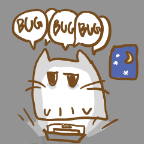

## Hi there 👋

  

I'm **LIN Le** — welcome to my page!

I'm currently a fourth-year undergraduate student at South China University of Technology, supervised by Professor LI GuiQing, majoring in Mathematics and Applied Mathematics with a minor in Computer Science and Technology. I'm also a visiting student at VisLab, in the Department of Computer Science and Engineering at Hong Kong University of Science and Technology. My interests lie in Computer Graphics.

I'm an amateur artist and athlete. I enjoy watercolor, digital painting, running, and orienteering.

I'm always excited to meet new people and exchange ideas—feel free to reach out and say hi! 😊

<!--
**BuggingCat/BuggingCat** is a ✨ _special_ ✨ repository because its `README.md` (this file) appears on your GitHub profile.

Here are some ideas to get you started:

- 🔭 I’m currently working on ...
- 🌱 I’m currently learning ...
- 👯 I’m looking to collaborate on ...
- 🤔 I’m looking for help with ...
- 💬 Ask me about ...
- 📫 How to reach me: ...
- 😄 Pronouns: ...
- ⚡ Fun fact: ...
-->

